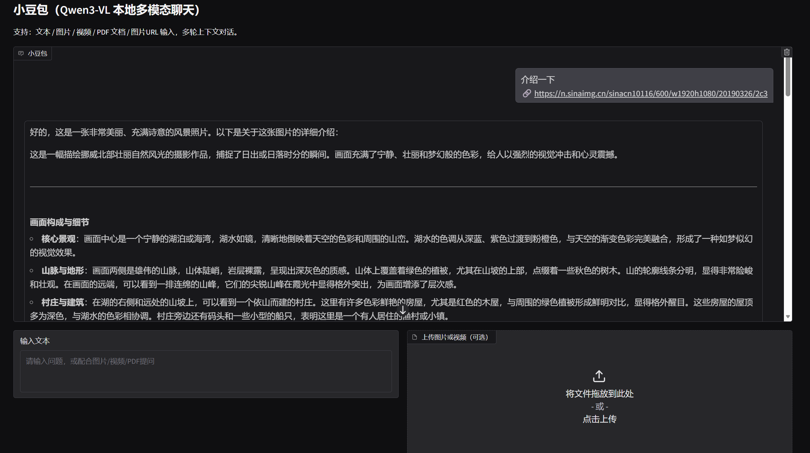
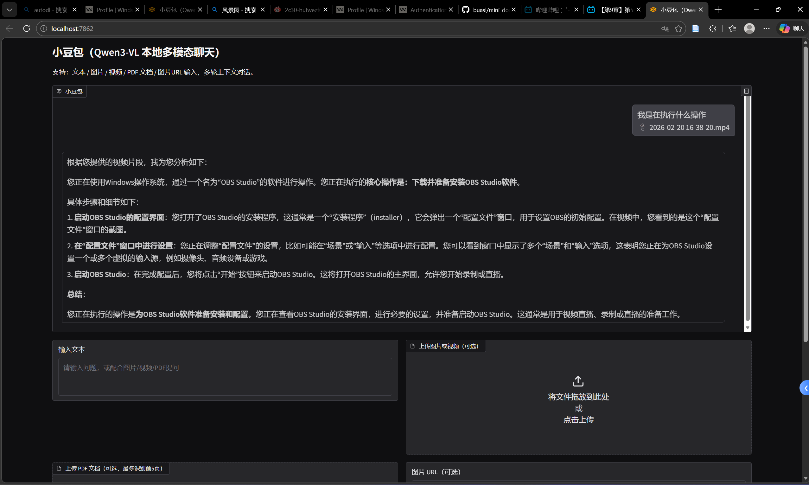

# 小豆包 —— 基于 Qwen3-VL 的本地多模态聊天系统

> 课程作业项目：在 AutoDL 云服务器上部署 Qwen3-VL-2B-Instruct 多模态大模型，实现一个支持文本、图片、视频、PDF、URL 图片输入的多轮对话 Web 应用。

---

## 📁 仓库结构

```
Qwen3-VL/
├── my_doubao_app.py            # 核心程序（前端 + 后端 + 推理，一体化）
├── requirements_doubao.txt     # Python 依赖清单
├── README.md                   # 本文件（项目说明 & 技术文档）
├── .gitignore                  # Git 忽略规则
├── Qwen3-VL-2B-Instruct/      # 模型权重目录（不提交，见 .gitignore）
└── scripts/
    ├── run.sh                  # 一键启动脚本
    └── infer.py                # 命令行推理示例
```

---

## 🖥️ 硬件环境

| 项目 | 配置 |
|------|------|
| **云平台** | AutoDL |
| **GPU** | NVIDIA RTX 4090 (24 GB VRAM) |
| **系统** | Ubuntu 22.04 |
| **CUDA** | 12.8 |
| **Python** | 3.12 |
| **PyTorch** | 2.8 |

> Qwen3-VL-2B-Instruct 模型在 RTX 4090 上加载约占 **5–6 GB 显存**（FP16/BF16），剩余显存可用于上下文token。

---

## 🛠️ 环境搭建与依赖安装

### 方式一：Transformers 后端（默认）

AutoDL 开机镜像已预装 PyTorch 2.8 + CUDA 12.8，直接在 base 环境中安装即可：

```bash
# 1. 进入项目目录
cd /root/autodl-tmp/Qwen3-VL

# 2. 安装项目依赖
pip install -r requirements_doubao.txt
```

### 方式二：vLLM 后端（高吞吐 / 生产级）

由于 vLLM 对依赖版本有严格要求，需要单独创建 conda 虚拟环境以避免冲突：

vllm 对依赖的pytorch版本有特定要求，在执行`pip install vllm`时会自动装好pytorch

```bash
# 1. 创建并激活 conda 环境
conda create -n vllm python=3.12 -y
conda activate vllm

# 2. 安装 vLLM
pip install vllm

# 3. 安装项目其余依赖
pip install -r requirements_doubao.txt
```

---

## 🚀 启动项目

### Transformers 后端启动

```bash
# 基础启动（本机访问）
python my_doubao_app.py 

# 生成公网分享链接（Gradio share）
python my_doubao_app.py \
    --model-path ./Qwen3-VL-2B-Instruct \
    --host 0.0.0.0 \
    --port 7861 \
    --share
```

### vLLM 后端启动

```bash
conda activate vllm

python my_doubao_app.py \
    --model-path ./Qwen3-VL-2B-Instruct \
    --backend vllm \
    --gpu-memory-utilization 0.9 \
    --max-model-len 8192 \
    --host 0.0.0.0 \
    --port 7861
```

### 全部命令行参数

| 参数 | 默认值 | 说明 |
|------|--------|------|
| `--model-path` | `./Qwen3-VL-2B-Instruct` | 模型目录或 HuggingFace ID |
| `--host` | `127.0.0.1` | 监听地址 |
| `--port` | `7861` | 监听端口 |
| `--backend` | `transformers` | 推理后端：`transformers` 或 `vllm` |
| `--max-new-tokens` | `16384` | 最大生成 token 数 |
| `--cpu-only` | `false` | 仅用 CPU（极慢，仅 transformers） |
| `--gpu-memory-utilization` | `0.9` | vLLM 显存占用比例 |
| `--max-model-len` | `8192` | vLLM KV Cache 最大序列长度 |
| `--share` | `false` | 生成 Gradio 公网链接 |
| `--inbrowser` | `false` | 自动打开浏览器 |

---

## ✨ 功能说明

`my_doubao_app.py` 是一个**前后端一体化**的多模态聊天应用，核心功能如下：

### 前端（Gradio Web UI）
- 基于 Gradio Blocks 构建的聊天界面，标题为"小豆包"
- 支持多轮对话，带完整上下文记忆
- 提供 Temperature / Top-P 采样参数滑块，实时调节生成策略
- 一键清空会话并释放 GPU 显存

### 后端推理引擎
- **DoubaoAssistant**（Transformers 后端）：使用 `AutoModelForImageTextToText` 加载模型，支持流式输出（`TextIteratorStreamer`）
- **VllmDoubaoAssistant**（vLLM 后端）：使用 vLLM 的 `LLM.chat()` 接口，适合高吞吐场景

### 多模态输入
| 输入类型 | 支持格式 | 说明 |
|----------|----------|------|
| 📝 文本 | 任意文本 | 直接在输入框输入 |
| 🖼️ 图片 | jpg / png / webp / bmp 等 | 通过文件上传控件 |
| 🎬 视频 | mp4 / avi / mkv / mov / webm 等 | 通过文件上传控件 |
| 📄 PDF | .pdf | 自动将前 5 页转为图片送入模型（依赖 PyMuPDF） |
| 🔗 UR 图片 | http/https 链接 | 自动下载并识别 |

### 推理特性
- 流式逐 token 输出，实时显示生成过程
- 支持贪心解码（Temperature=0）和核采样（Temperature>0 + Top-P）
- 多轮对话自动拼接历史消息

---

## 📸 Demo 截图 & 录屏

> 以下为项目运行效果，截图和录屏请自行替换。

### 聊天界面


<!-- 替换为实际截图路径 -->

### 图片理解


<!-- 替换为实际截图路径 -->

### PDF 文档解析


<!-- 替换为实际截图路径 -->

### 视频理解


<!-- 替换为实际截图路径 -->

### 演示录屏


<!-- 替换为实际录屏 GIF 或视频链接 -->

---

## 📊 技术说明文档

### 资源占用

| 指标 | Transformers 后端 | vLLM 后端 |
|------|-------------------|-----------|
| **模型加载显存** | ~5.5 GB (BF16) | ~5.5 GB (BF16) |
| **推理峰值显存** | ~8–12 GB（视输入长度） | ~16–20 GB（含 KV Cache） |
| **系统内存** | ~4 GB | ~6 GB |
| **磁盘占用（模型）** | ~4.5 GB | ~4.5 GB |

> 在 RTX 4090 (24 GB) 上两种后端均可流畅运行。若显存不足可降低 `--max-model-len` 或 `--gpu-memory-utilization`。

### 推理延迟（RTX 4090 实测参考）

| 场景 | Transformers | vLLM |
|------|-------------|------|
| 纯文本短问答（~50 tokens） | ~1–2 秒 | ~0.5–1 秒 |
| 单张图片描述（~200 tokens） | ~3–5 秒 | ~2–3 秒 |
| PDF 5 页解析（~500 tokens） | ~8–15 秒 | ~5–10 秒 |
| 短视频理解（~300 tokens） | ~5–10 秒 | ~3–6 秒 |

> 以上为首 token 到完成的端到端时间，Transformers 后端支持逐 token 流式显示，体感延迟更低。

### 输入输出示例

**示例 1：纯文本对话**
```
用户：你好，请介绍一下你自己
模型：你好！我是小豆包，一个基于 Qwen3-VL 的多模态 AI 助手。我可以理解文本、图片、
      视频和 PDF 文档，并与你进行多轮对话。有什么我可以帮你的吗？
```

**示例 2：图片理解**
```
用户：[上传一张猫的照片] 这是什么动物？
模型：这是一只橘色的家猫，正趴在沙发上休息。它的毛色为橘黄色带有浅色条纹，
      眼睛微微眯着，看起来非常放松和惬意。
```

**示例 3：PDF 文档解析**
```
用户：[上传一份论文 PDF] 请总结这篇论文的主要贡献
模型：这篇论文的主要贡献包括：1) 提出了一种新的多模态融合架构……
      2) 在多个基准测试上取得了 SOTA 结果…… 3) ……
```

### 已知限制

| 限制 | 说明 |
|------|------|
| **PDF 页数上限** | 默认仅处理前 5 页（`max_pages=5`），超长文档需手动截取 |
| **视频长度** | 受显存和 `max_model_len` 限制，建议视频不超过 30 秒 |
| **并发能力** | 单用户单请求，不支持多用户并发推理 |
| **vLLM 流式** | vLLM 后端为"伪流式"（整体生成后分块输出），非逐 token 流式 |
| **URL 图片** | 仅支持直链图片 URL，不支持需要登录或 JS 渲染的页面 |
| **多轮上下文** | 历史消息全部拼接，超长对话可能触发 OOM 或被截断 |
| **CPU 模式** | 仅 Transformers 后端支持 `--cpu-only`，速度极慢，仅供调试 |
| **模型能力** | 2B 参数量为轻量版，复杂推理和长文本生成能力弱于更大模型 |
